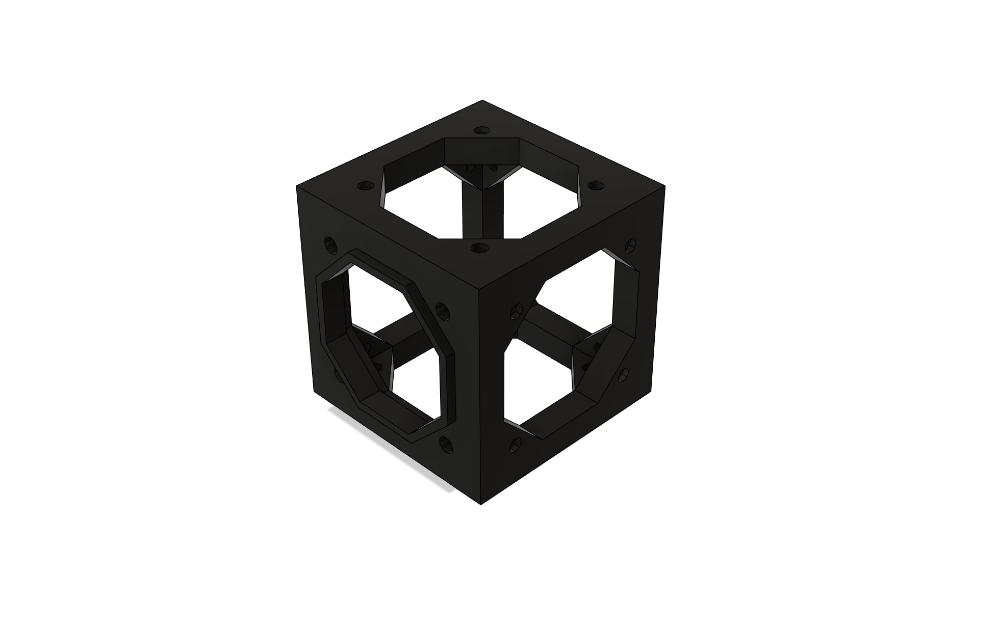
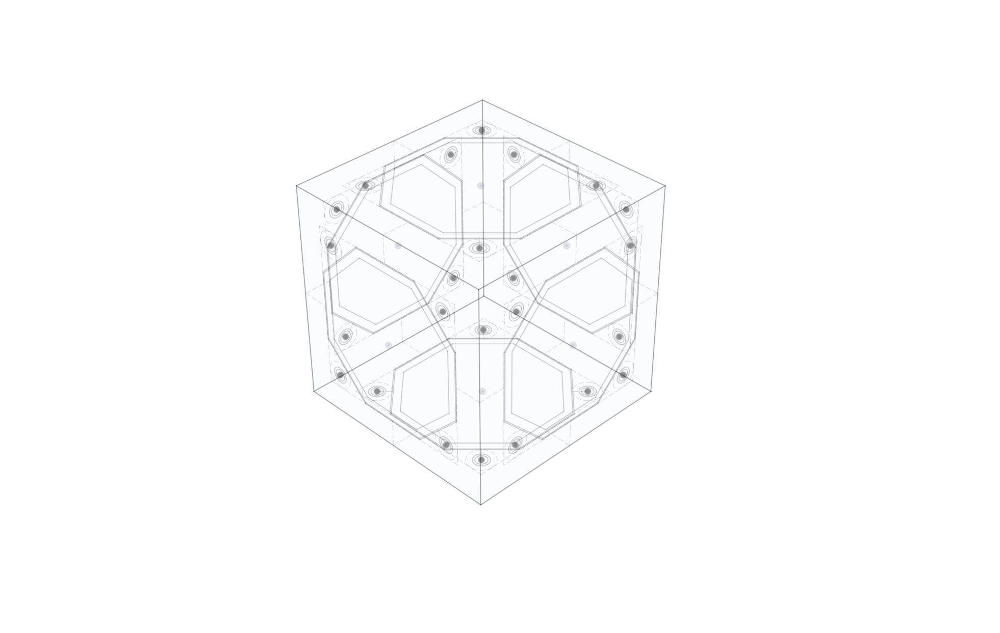
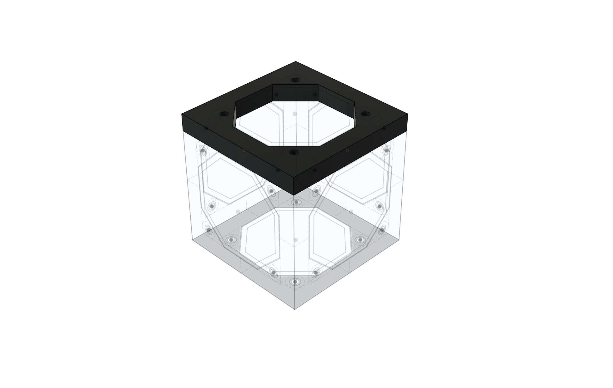
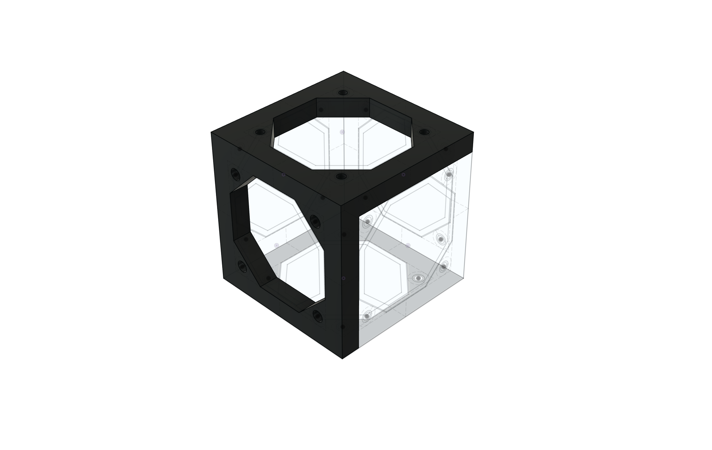

# Frame

The Frame is the skeleton of the robot.  It is the frame that holds everything together.

# Frame Core

At the heart of each Spoke Robot, there is the Frame core.  It is is the smallest frame necessary to enclose the minimal robotic function.

<STLViewer src="Cuboid_96x_64_32_4mm.stl" height={480} expandedHeight={480} name="Cuboid 96 64 32" shadingMode="BLACK" edgesMode="LIGHT GRAY" />

For ease of assembly frame lengths are drawn from a set canonical values, 32mm, 48, 64mm, 96mm, 128mm, etc.  

# Frame Construction

In order to make a frame, the core formed by the sides is extruded inwards from the sides, one by one.

At the end there's a full frame.

Note that the holes in the frame need to be the correct size for the thread cutting screws.

This is pretty straightforward in the case of 90° cuboids, where all the edges mesh nicely, but as soon as some of the angles are not 90°, additional trimming will be needed.

# Frame Interconnection

Frames designed to be connected to other frames have a modified connection.  The frame to be connected has one side with location features designed to connect to the target frame.  Obviously the connecting sides have to have the same dimensions.  Holes on the connecting side are larger to allow the screw to pass and to be secured into the other.

