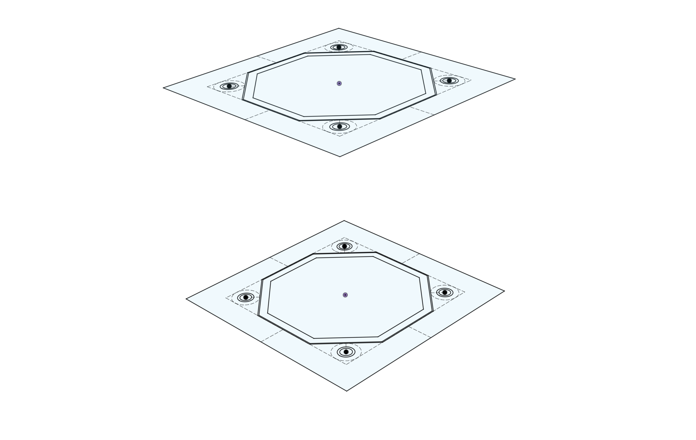
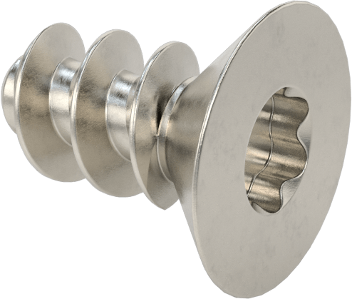

# Panels

Panels can be made from sides.

Panels have a core, and screw holes.  Also, to locate them in the frame, a small ridge.  Depending on the fasteners, the outside screw holes will be countersunk.

Panels are secured to the frame in a manner appropriate for the materials.  In some plastics, self tapping (thread forming) screws are very effective.  In other plastics,  threaded inserts will be ideal, possibly screws and nuts in some applications.

Panels can be customized for different purposes.
- holding PCBs
- holding batteries
- holding sensors

This a panel with PCB rails holding the Spoke Charger board.  This arrangement means that assembling the robot can be done from any place there is a panel.   PCBs can be accessed very easily just by removing the correct panel.  As another conventions, PCBs are made in standard widths to fit these rails.

A more complex example, this is a 96mm x 96mm panel that holds 4 18650 cells and three PCB rails for 28mm PCBs.  Also underneath there is a compartment for a Wireless Charging Receiver coil.

It fits into the 96mm x 96mm x 48mm core frame, and indeed any frame that has a standard 96mm x 96mm side and sufficent internal height to fit the contents.

In future many if not all panels will also have touch sense via built in piezo or resistive sensors. 
