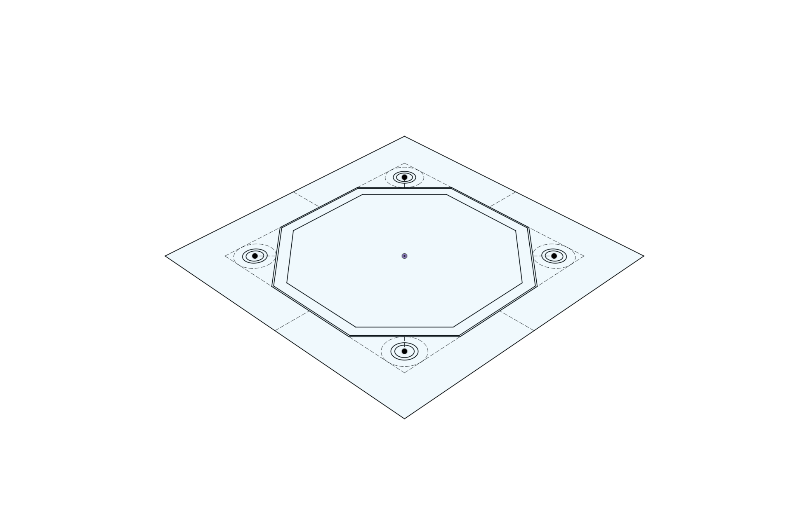
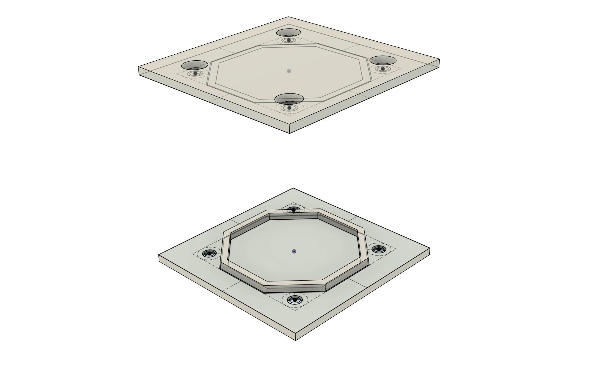
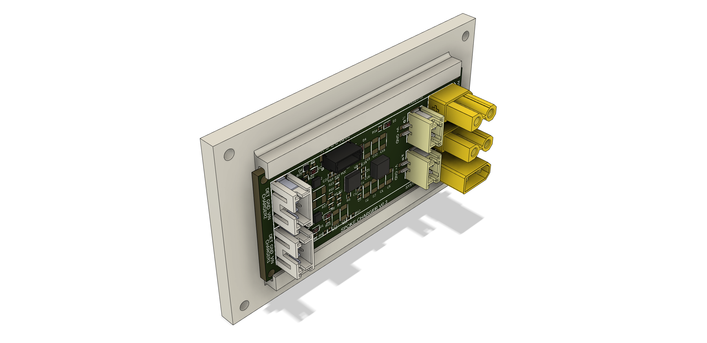
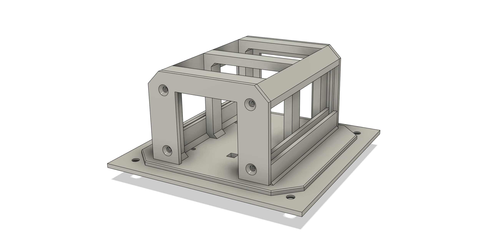
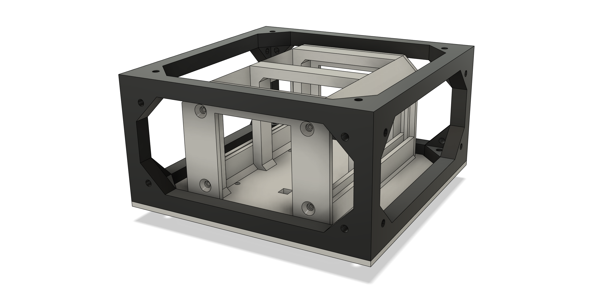
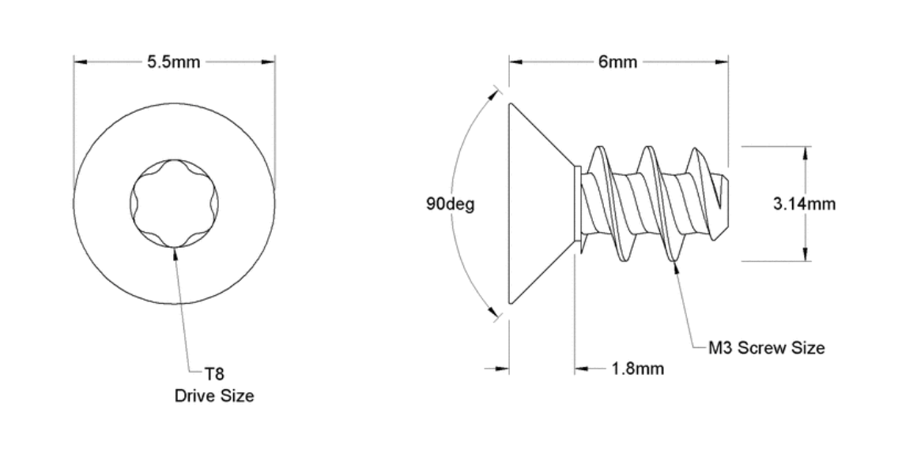

# Panel

# Sides

Panels are made from [sides](/docs/spoke-body/side).

Panels have a core, and screw holes.  Also, to locate them in the frame, a small ridge.  Depending on the fasteners, the outside screw holes will be countersunk.

# Purposes

Panels can be customized for different purposes.
- holding PCBs
- holding batteries
- holding sensors

This a panel with PCB rails holding the Spoke Charger board.  This arrangement means that assembling the robot can be done from any place there is a panel.   PCBs can be accessed very easily just by removing the correct panel.  As another conventions, PCBs are made in standard widths to fit these rails.

A more complex example, this is a 96mm x 96mm panel that holds 4 18650 cells and three PCB rails for 28mm PCBs.  Also underneath there is a compartment for a Wireless Charging Receiver coil.

It fits into the 96mm x 96mm x 48mm core frame, and indeed any frame that has a standard 96mm x 96mm side and sufficent internal height to fit the contents.

In future many if not all panels will also have touch sense via built in piezo or resistive sensors. 

# Core Sides

For the 96 x 64 x 32mm core there are several different panels:

## Power Panel

<ModelViewer src="RectPanel_96x_64_PcbMount_28_Power.stl" height={240} expandedHeight={480} name="Panel 96 64 w/Pcb Mount" shadingMode="CREAM" edgesMode="LIGHT GRAY" />
<ModelViewer src="RectPanel_96x_64_PcbMount_28_Power_Door.stl" height={240} expandedHeight={480} name="Panel 96 64 w/Pcb Mount" shadingMode="CREAM" edgesMode="LIGHT GRAY" />

The power panel has three purposes:
- holding a couple of PCBs on the inside of the frame
- holding the WPC coil for wireless charging
- holding the high current mag charging connector

The power panel has a door that secures the WPC coil on the outside.

## Pcb Panel

<ModelViewer src="RectPanel_96x_32_4mm.stl" height={240} expandedHeight={480} name="Panel 96 64 w/Pcb Mount" shadingMode="CREAM" edgesMode="LIGHT GRAY" />

The plain PCB panel serves only to secure a PCB, in the case of the core, it will hold the Spoke Controller.

## 18650 Cell Panel

<ModelViewer src="RectPanel_96x_32_Cell_18650_4mm.stl" height={240} expandedHeight={480} name="Panel 96 64 w/Pcb Mount" shadingMode="CREAM" edgesMode="LIGHT GRAY" />

On the sides are two panels that hold an 18650 cell each.

# Screws

Panels are secured to the frame in a manner appropriate for the materials.  In some plastics, self tapping (thread forming) screws are very effective.  In other plastics,  t## Power Panelhreaded inserts will be ideal, possibly screws and nuts in some applications.

