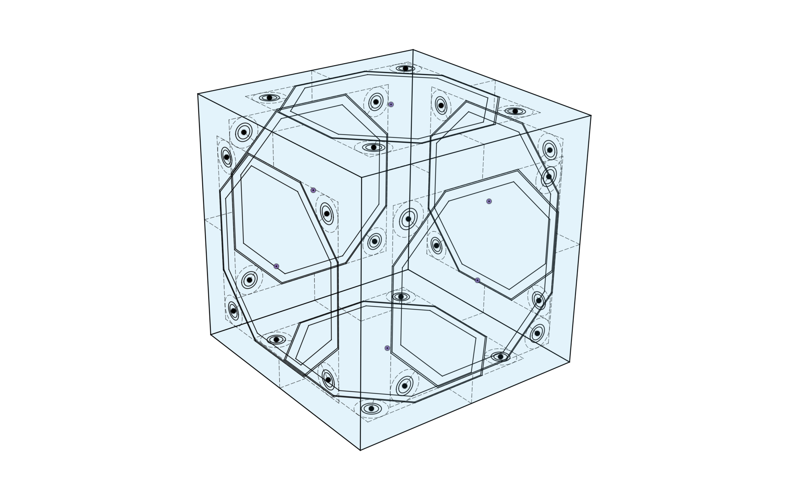

# SIDE

Sides are the building blocks of the body system.  They're complex enough that it isn't ideal to recreate them each time, so they are designed separately.   

In CAD, sides are designed as sketches.  These sketches capture the core features of each side.  
- width and height
- beam dimensions
- hole dimensions
- internal location features

With these dimensions decided, the side becomes an interface, a way to allow disparate parts to connect together.   

[image of side annotated - TBD]

The corners are the hardest part.  They have to be large enough to strongly anchor the panel to the frame, and large enough to permit a nut behind too.

**Corner Details**

 How are the corners placed?  There are three main issues: general layout, design of the corner shape, and placement of the fastening holes.

 Mostly there will be one corner for each pair of sides.  This is not a rigid rule, however.  In some cases a side is so short that two corners can not easily fit.  In other cases the integrity of the frame would be compromised by the holes or passage ways required for fastening.  In these cases the corner geometry may be altered.  For example two corners might be joined together to form one area with a single screw hole.

 In most cases, the simple solution of having a simple corner for each pair of sides works very well.

 Refering from the angle formed by the two sides, the diagonal member should be as symmetrical as possible.  In the trivial case of two sides intersecting at 90°, the diagonal member should be at 45°.

 As an additional constraint, the three (or sometimes two) sides of the corner structure all need to touch the screw head circle at a tangent.

**Side Assemblies**

Then sides can be assembled together to form the core of the Frame.

A library of sides would need to include all the sizes and shapes needed.
